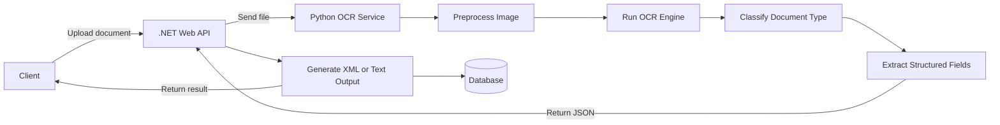
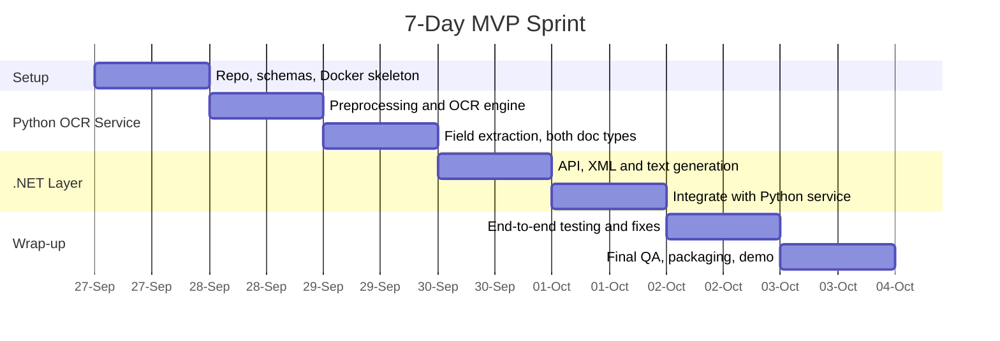

# OCR Document Scanner — Project Plan & Development Workflow

**Prepared:** September 27, 2026
**Deadline:** October 3, 2026 — **6 days away**
**Proposed stack:** Python (OCR/extraction engine) + .NET (API, orchestration, output layer)
**Output:** XML and plain text, selectable per request

---

## ⚠️ Timeline Reality Check — Read This First

Six days is a tight window for a two-service OCR pipeline covering two document types and two output formats. This plan is deliberately scoped as an **MVP-first sprint**, not a "complete product" — Section 8 draws the MVP/Phase-2 line explicitly, and Section 11 tells you exactly what to cut first if the week gets away from you. Read Section 11 today, not on day 5.

The biggest risk to this deadline isn't the code — it's **scope**. "Marksheets, bills, etc." could mean two fixed layouts or twenty layouts from different boards and vendors. Get that confirmed with the client before Day 2 (Section 12 has the exact questions to ask).

---

## 1. Project Overview

**What it does:** Accepts scanned/photographed marksheets, bills, and similar documents; runs OCR; extracts structured fields; returns the result as **XML** or **plain text**.

**The tension you're solving:** the client wants the system built in **.NET**; you want to use **Python** for the OCR/ML work, since Python's OCR and computer-vision ecosystem is meaningfully ahead of .NET's.

**The resolution:** a hybrid architecture. The client-facing system — the API they integrate with, the thing that's "the product" — is .NET. Python runs behind it as an internal OCR microservice the client never has to touch directly. This isn't a compromise bolted on to keep two people happy; it's a standard pattern in .NET shops that need real computer-vision or ML capability, since that ecosystem still lives mostly in Python. (A pure-.NET OCR path does exist — wrappers like IronOCR or Tesseract-.NET — but it trails Python's OCR/CV ecosystem on accuracy and flexibility, especially for anything beyond clean printed text. Worth knowing if the client questions the hybrid approach.)

---

## 2. Architecture

### 2.1 Responsibility Split

| Layer | Technology | Responsible for |
|---|---|---|
| Client-facing API & orchestration | .NET 10, ASP.NET Core | Upload endpoint, request orchestration, XML/text generation, database, client integration, auth |
| OCR & extraction engine | Python 3.12/3.13, FastAPI | Image preprocessing, OCR, document classification, field extraction, confidence scoring |
| Internal communication | REST + JSON over HTTP | .NET calls the Python service as an internal dependency |
| Storage | SQL Server or PostgreSQL + file/blob storage | Extracted data, audit trail, original files |

### 2.2 System Diagram



---

## 3. Tech Stack

### 3.1 .NET side
- **.NET 10** (current LTS — released November 2025, supported through November 2028). Worth calling out: .NET 8's support window ends November 10, 2026, weeks after your deadline, so there's no reason to start a new build on it now.
- ASP.NET Core Web API
- `System.Xml.Linq` (`XDocument`) for XML generation
- Entity Framework Core + SQL Server or PostgreSQL for metadata
- Swashbuckle/Swagger for API docs — this can double as your demo interface if there's no time left for a UI

### 3.2 Python side
- **Python 3.12 or 3.13** — every OCR/CV library you'll need has mature, prebuilt wheels for these versions. Python 3.14 is the current stable release generally, but this isn't the week to risk a dependency install failing on day two for the sake of being on the newest version.
- FastAPI + Uvicorn
- OpenCV + Pillow — preprocessing (deskew, denoise, contrast, binarization)
- `pdf2image` or `PyMuPDF` — convert scanned PDF bills to images before OCR
- OCR engine — pick **one** path given the deadline:

| Path | Tool | Time to integrate | Accuracy | Cost |
|---|---|---|---|---|
| **A — recommended for this deadline** | Azure AI Document Intelligence (prebuilt invoice/receipt models, or a custom model) | Fastest — hours | High on structured layouts, handles handwriting reasonably | Roughly $1.50/1,000 pages for OCR-only, ~$10/1,000 for prebuilt models, ~$30/1,000 for custom models — confirm current pricing before committing |
| B | PaddleOCR or EasyOCR (open-source) | Medium — a day or two of tuning | Good on printed text | Free, self-hosted |
| C | Tesseract (`pytesseract`) | Fastest to install, most tuning needed | Fair on clean printed text, weak on noisy scans | Free, self-hosted |

Given six days, Path A meaningfully de-risks the schedule — building a reliable extraction pipeline from raw Tesseract output, across two document types, in under a week is the single riskiest piece of this plan. Python still owns preprocessing, orchestration, and turning the OCR result into structured fields either way, so it stays central to the architecture as you intended. (Worth knowing: Document Intelligence also ships a native .NET SDK, so this piece could move to the .NET side later if you ever want to simplify — not a decision to make now.)
- Regex/rule-based extraction for structured fields (roll numbers, subject-mark tables, invoice numbers, totals)
- `spaCy` — only if regex turns out insufficient for name/entity extraction; treat as a Phase 2 upgrade, not Day 1 work

### 3.3 Infrastructure
- Docker + docker-compose for both services from Day 1, so environment mismatches don't cost you a day later in the week
- Hosting: confirm with the client whether this runs on their infrastructure or can go to a cloud provider — this affects deployment, decide by Day 2

---

## 4. Output Formats

The API should accept a `format=xml|text` parameter so both are served from one pipeline instead of building two.

### 4.1 XML — marksheet example
```xml
<?xml version="1.0" encoding="UTF-8"?>
<Marksheet>
  <Student>
    <Name>RAVI KUMAR SHARMA</Name>
    <RollNumber>2024103567</RollNumber>
    <Board>CBSE</Board>
  </Student>
  <Subjects>
    <Subject name="English" maxMarks="100" obtainedMarks="88" />
    <Subject name="Mathematics" maxMarks="100" obtainedMarks="92" />
  </Subjects>
  <Summary>
    <TotalMarks>180</TotalMarks>
    <MaxTotal>200</MaxTotal>
    <Percentage>90.0</Percentage>
    <Result>PASS</Result>
  </Summary>
  <Meta>
    <OcrConfidence>0.94</OcrConfidence>
    <ProcessedAt>2026-09-29T10:15:00Z</ProcessedAt>
  </Meta>
</Marksheet>
```

### 4.2 XML — bill/invoice example
```xml
<?xml version="1.0" encoding="UTF-8"?>
<Invoice>
  <InvoiceNumber>INV-2026-00456</InvoiceNumber>
  <InvoiceDate>2026-09-15</InvoiceDate>
  <Vendor>
    <Name>Sharma Electronics</Name>
  </Vendor>
  <Items>
    <Item name="LED Bulb 9W" quantity="4" unitPrice="120.00" total="480.00" />
    <Item name="Extension Cord" quantity="1" unitPrice="350.00" total="350.00" />
  </Items>
  <Summary>
    <SubTotal>830.00</SubTotal>
    <Tax>149.40</Tax>
    <TotalAmount>979.40</TotalAmount>
  </Summary>
</Invoice>
```

### 4.3 Plain text example
```text
=== MARKSHEET EXTRACTION RESULT ===
Name: RAVI KUMAR SHARMA
Roll Number: 2024103567
English: 88/100
Mathematics: 92/100
Total: 180/200 (90.0%)
Result: PASS
```

---

## 5. Internal API Contract (.NET ↔ Python)

**.NET → Python:** `POST /ocr/extract`
```json
{
  "fileBase64": "<base64 image or pdf>",
  "fileName": "marksheet_0007.jpg",
  "documentTypeHint": "marksheet"
}
```

**Python → .NET (response)**
```json
{
  "success": true,
  "documentType": "marksheet",
  "rawText": "RAVI KUMAR SHARMA ...",
  "confidence": 0.94,
  "fields": {
    "name": "RAVI KUMAR SHARMA",
    "rollNumber": "2024103567",
    "totalMarks": 180
  }
}
```

**Client-facing (.NET)**
```text
POST /api/documents                    → upload file, returns { documentId, status }
GET  /api/documents/{id}?format=xml    → final XML
GET  /api/documents/{id}?format=text   → final plain text
```

---

## 6. Suggested Repo Structure

```
ocr-scanner/
├── dotnet-service/
│   ├── OcrScanner.Api/
│   ├── OcrScanner.Core/
│   └── OcrScanner.Tests/
├── python-ocr-service/
│   ├── app/
│   │   ├── main.py
│   │   ├── preprocessing.py
│   │   ├── ocr_engine.py
│   │   └── extractors/
│   │       ├── marksheet_extractor.py
│   │       └── bill_extractor.py
│   ├── requirements.txt
│   └── tests/
├── docs/
├── docker-compose.yml
└── README.md
```

---

## 7. Development Workflow (Sep 27 → Oct 3, 2026)



| Day | Date | Focus | Deliverable |
|---|---|---|---|
| 1 | Sep 27 (Sun) | Lock scope with client; repo setup; agree on XML schema and API contract; Docker skeleton for both services | Repo scaffolded, contracts agreed |
| 2 | Sep 28 (Mon) | Python: preprocessing pipeline + OCR engine wired up (chosen path from §3.2) | Raw OCR text out of sample documents |
| 3 | Sep 29 (Tue) | Python: field extraction for marksheets + bills, confidence scoring | `/ocr/extract` returns structured JSON |
| 4 | Sep 30 (Wed) | .NET: Web API, upload endpoint, XML + text generation from JSON | .NET produces valid output from mock JSON |
| 5 | Oct 1 (Thu) | Wire .NET → Python end-to-end, DB persistence | Full pipeline runs on sample documents |
| 6 | Oct 2 (Fri) | Test against real samples, handle edge cases and errors, write minimal docs | Stable build, known issues logged |
| 7 | Oct 3 (Sat) | Final QA, one-command Docker Compose run, demo prep, handover | Delivered build + demo |

---

## 8. MVP Scope vs. Phase 2

**MVP — must-have by Oct 3**
- Upload → OCR → extract → XML/text output, for clearly printed marksheets and bills
- One primary layout per document type, not every board/vendor variant that exists
- Basic error handling (corrupt file, unreadable scan)
- Swagger UI as the interface if there's no time for a proper front-end
- Dockerized, runs with one command

**Phase 2 — after handover**
- Handwriting support, additional boards/vendors/layouts
- ML-based document classification instead of a hint/rule-based approach
- Multi-language OCR if source documents mix English with Hindi or other regional-language text (Tesseract's `eng+hin` pack, or the equivalent in the cloud OCR option)
- A manual-review queue for low-confidence extractions
- Auth hardening, rate limiting, audit logging
- Cloud deployment and autoscaling
- XSD schema validation for the XML outputs
- Optionally, a multimodal-LLM-based extraction pass for messy or handwritten documents where rule-based extraction struggles — worth evaluating once the rule-based baseline is in place, not before

---

## 9. Handling Sensitive Data

Marksheets and bills carry personal and financial data — names, roll numbers, amounts, vendor details. Even at MVP stage:
- Don't log full extracted content in plaintext logs
- Encrypt uploaded files and database contents at rest where the hosting environment makes that easy
- Gate the API behind at least a basic API key for MVP; treat proper auth (OAuth, per-client keys) as Phase 2

---

## 10. Testing

- Collect 10–15 real sample documents today — mixed scan quality, both document types. This is the actual bottleneck, not the code.
- Unit tests: extraction logic (Python), XML generation (.NET)
- End-to-end: run every sample through the full pipeline and check the output against the source by hand
- Track a simple accuracy count per document — you'll want that number when you talk to the client about what "done" means

---

## 11. If You Fall Behind — Cut in This Order

1. Drop the front-end entirely — deliver via Swagger plus a Postman collection
2. Take one document type all the way through (marksheets **or** bills), leave the other partial
3. Switch to the cloud OCR path (§3.2, Path A) even if you'd planned to self-host — it buys back the most time of any single decision
4. Ship text output first, add XML after — it's a thin layer over the same extracted JSON once the fields are right, so this is a fast follow, not a redo
5. Skip the database — return results directly from the API without persistence, add storage after handover

---

## 12. Open Questions for the Client

- Which exact document types/boards/vendors count as "marksheets, bills, etc." — ask for named examples, not a category
- Source format: phone photos, flatbed scans, or existing PDFs?
- Expected volume — 10 documents a day and 10,000 a day call for different architectures
- Hosting: client's own servers, or cloud?
- Any existing system this needs to integrate with — that's likely *why* .NET is a hard requirement, and worth confirming directly

---

*This is a planning draft (v1). Confirm the assumptions above with the client and update this file as answers come in.*
